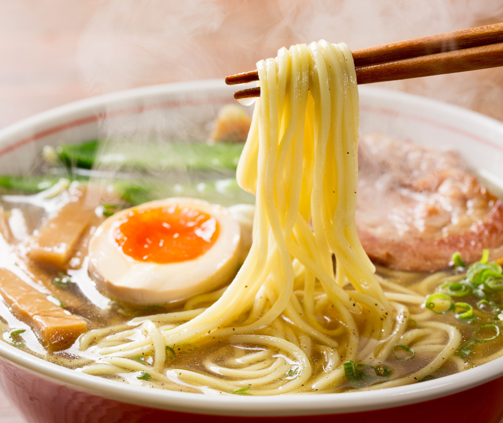

# Ramen

## Description

**A Japanese original meal.**

## Ingredients

- 1 tablespoon sesame oil
- 3 teaspoons grated ginger
- 4 teaspoons grated garlic
- 4 cups broth (I used chicken, but vegetable would also work)
- 4 cups water
- 1 ounce dried shiitake mushrooms
- 2 packages instant ramen (noodles only!)
- 1/2 cup chopped scallions or chives
- 2 cup chopped kale
- 1 cups shredded carrots
- Sriracha to taste
- crunchy golden panko crumbs for topping

